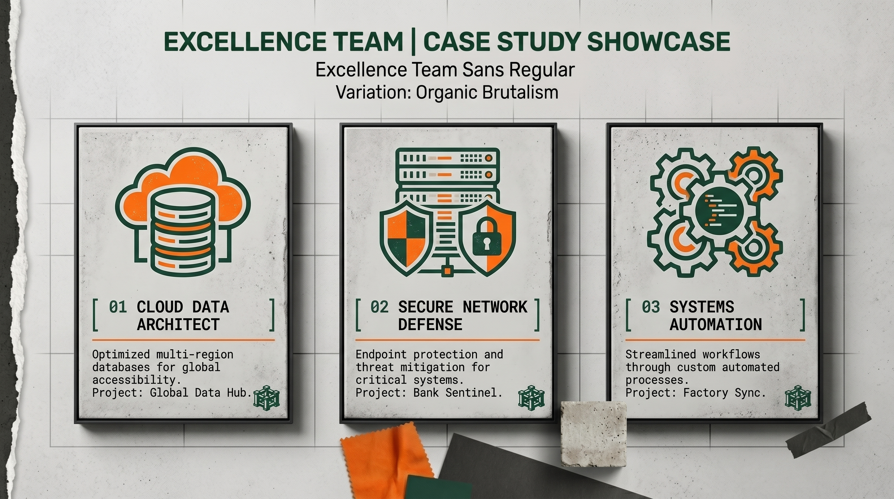

# Brandboard de Synthèse — Excellence Team
## Tableau Récapitulatif de la Marque (BRANDBOARD.md)

Le **Brandboard** est une vue d'ensemble condensée de tous les éléments graphiques et conceptuels d'Excellence Team. Il permet d'avoir en un seul coup d'œil les piliers visuels de la marque.

---

## 1. Identité Conceptuelle & Axe Final

*   **Axe Stratégique :** Team • Tech • Innovation
*   **Mission :** Prouver que la vigueur, l'ambition et la capacité d'apprentissage de la jeunesse étudiante peuvent concevoir une innovation technologique de classe mondiale.
*   **Vibe Graphique :** Brutalisme Minimaliste / Tech Industrielle / Transparence Open Source.

---

## 2. Palette de Couleurs

```
[ VERT FORÊT PRIMAIRE ]   #1A433A  (Rigueur, profondeur, rigueur académique)
[ ORANGE TECH ACCENT ]    #FF701A  (Jeunesse, force, dynamisme, innovation)
[ BÉTON CLAIR BG ]        #F2F1ED  (Minimalisme, clarté, modernité)
[ SLATE CLOUD BG ]        #0F172A  (Ingénierie cloud, sécurité, profondeur tech)
```

---

## 3. Typographie

*   **Principale (Sans-serif) :** Arial / Inter / Outfit
*   **Code & Détails (Monospace) :** Consolas / Fira Code

---

## 4. Aperçu du Rendu Web & Maquettes d'Interfaces

Pour valider le comportement de notre identité visuelle sur une interface web en production, nous utilisons des maquettes réalistes de nos applications.

### Maquette Graphique de Dashboard & Projet SaaS
Ce mockup simule l'intégration de nos couleurs, de notre typographie sans-serif moderne, de nos cartes Slate sombres et de l'accent orange tech :


*   **Ressenti utilisateur :** Interface épurée, centrée sur la donnée, hautement contrastée et immersive.
*   **Comportement adaptatif :** Parfaitement aligné sur la grille de mise en page spécifiée dans la charte de design.

---

## 5. Inventaire des Fichiers de la Suite d'Identité

Voici la structure complète de notre dossier d'identité visuelle dans le workspace :

| Nom du Fichier | Contenu Principal | Lien Direct |
| :--- | :--- | :--- |
| **`DESIGN.md`** | Tokens de design (couleurs, typo, arrondis, layout de grille). | [DESIGN.md](./DESIGN.md) |
| **`MOODBOARD.md`** | Note d'intention créative, moodboard visuel collaboratif d'équipe. | [MOODBOARD.md](./MOODBOARD.md) |
| **`IDENTITE_VISUELLE.md`** | Charte du logo, déclinaisons, règles et droits légaux des images. | [IDENTITE_VISUELLE.md](./IDENTITE_VISUELLE.md) |
| **`PRESENTATION.md`** | Contenu du Pitch Deck stratégique rédigé selon le guide de copywriting. | [PRESENTATION.md](./PRESENTATION.md) |
| **`BRANDBOARD.md`** | Présent document de synthèse visuelle et inventaire des fichiers. | [BRANDBOARD.md](./BRANDBOARD.md) |

---

## 6. Inventaire des Fichiers Visuels du Workspace

Tous les visuels de marque se situent à la racine du workspace et sont directement intégrés dans nos documents de spécification :

*   **Identité & Couleurs :**
    *   Fiche colorimétrique : `../Brand_identity_sheet_colorimetry…_2K_202608070006.jpeg`
    *   Synthèse d'identité de marque : `../Excellence_Team_brand_identity_s…_202608070006.jpeg`
*   **Logo & Déclinaisons :**
    *   Exemple de logo sur fond clair : `../Excellence_Team_brand_logo_displ…_202608070047.jpeg`
    *   Exemple de logo sur fond sombre : `../Excellence_Team_brand_logo_displ…_202608070049.jpeg`
    *   Maquette de placement du logo : `../Brand_identity_logo_placement_mo…_202608070006.jpeg`
*   **Moodboard & Univers Visuel :**
    *   Moodboard collaboratif d'équipe : `../Brand_identity_moodboard_for_team_202608070006.jpeg`
    *   Langage visuel global : `../Visual_language_design_sheet_2K_202608070007.jpeg`
    *   Style pictographique et image : `../Visual_language_design_sheet_pic…_202608070007.jpeg`
    *   Style textuel : `../Visual_language_design_sheet_tex…_202608070007.jpeg`
*   **Mise en Page & Web :**
    *   Spécification de grille web : `../Web_layout_grid_specification_sheet_202608070010.jpeg`
    *   Maquette web applicative : `../Website_graphic_mockup_of_projec…_202608070043.jpeg`
*   **Diaporamas de Présentation (Pitch Deck) :**
    *   Couverture du Pitch Deck : `../Excellence_Team_pitch_deck_title_202608070042.jpeg`
    *   Diapositive d'introduction : `../Excellence_Team_pitch_deck_intro…_202608070017.jpeg` (et alternative `... (1).jpeg`)
    *   Diapositive Problème : `../Pitch_deck_problem_slide_design_202608070022.jpeg` (et alternative `... 2023.jpeg`)
    *   Diapositive Solution : `../Pitch_deck_product_solution_slide_202608070026.jpeg`
    *   Schéma d'architecture technique : `../System_architecture_blueprint_fo…_2K_202608070044.jpeg`
    *   Diapositive Équipe : `../Pitch_deck_team_slide_layout_202608070033.jpeg` (et alternatives `Minimalist..._202608070032.jpeg` et `Excellence..._202608070032.jpeg`)
    *   Diapositive Conclusion : `../Excellence_Team_pitch_deck_closi…_202608070035.jpeg` (et alternative `... (1).jpeg`)
