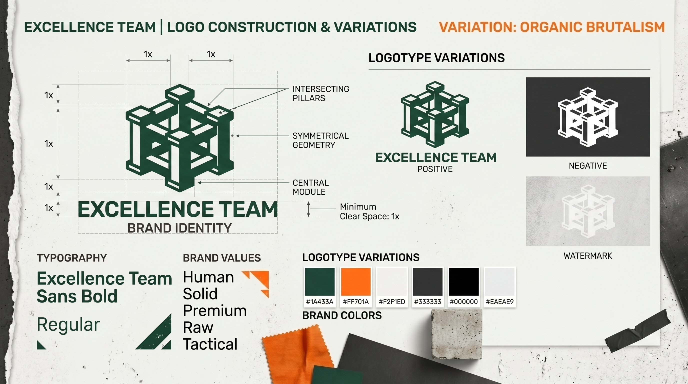
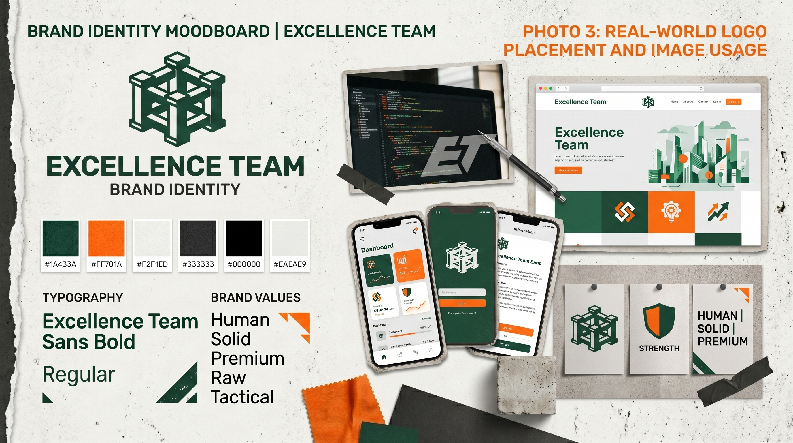
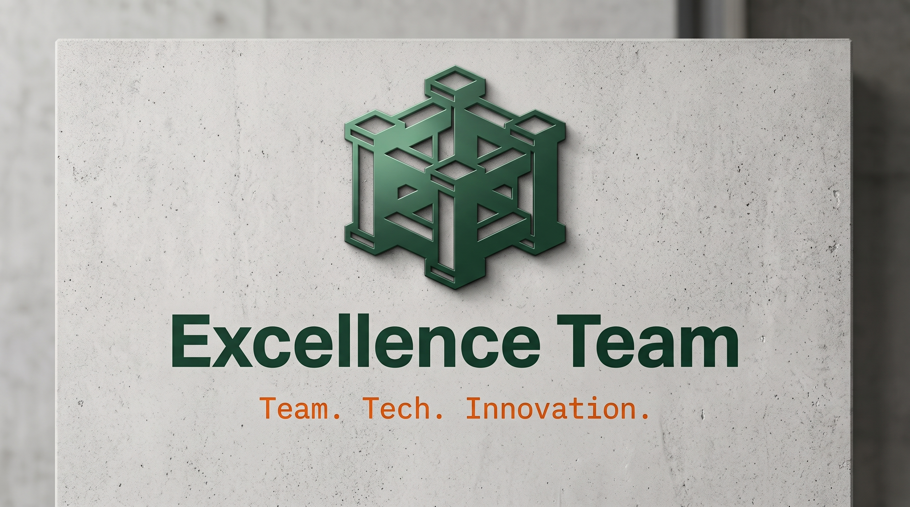
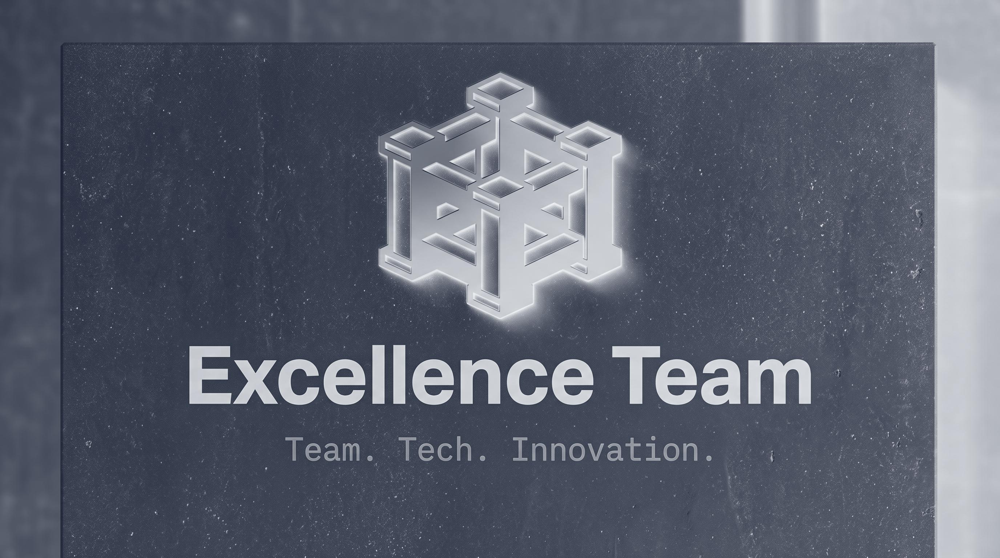

# Charte Graphique & Identité Visuelle — Excellence Team
## Guide d'Utilisation de la Marque (IDENTITE_VISUELLE.md)

Ce document rassemble les règles d'utilisation de la marque **Excellence Team**, de la mise en page du logo à l'intégration réglementaire des images, icônes, ainsi que la gestion des droits et des autorisations d'utilisation.

---

## 1. Logo & Placement (Logo Guidelines)

Le logo d'Excellence Team est minimaliste et technique. Il utilise des formes géométriques pures pour incarner le sérieux de la tech et la fougue de l'innovation.

### Directives d'Intégration du Logo

*   **Zone d'exclusion :** Maintenir un espace vide équivalent à la hauteur du "E" tout autour du logo pour éviter les surcharges.
*   **Taille minimale :** 32px de hauteur pour le web, 15mm pour l'impression.
*   **Variantes autorisées :** Horizontal (logo à gauche, texte à droite) et vertical (centré).

### Maquettes de Placement (Logo Placement Mockups)
Pour voir le comportement du logo sur différents supports (T-shirts, goodies, en-têtes d'applications), consultez :

---

## 2. Contraste & Déclinaisons (Light vs Dark Mode)

Le logo et les éléments de marque s'adaptent selon les modes d'affichage.

*   **Sur Fond Clair (Béton Doux / Blanc) :** Le logo s'affiche en Vert Forêt profond (`#1A433A`) avec des accents en Orange Tech (`#FF701A`).
    *   Exemple de rendu : 
*   **Sur Fond Sombre (Slate Profond) :** Le logo s'affiche en Blanc Pur (`#F8FAFC`) avec des accents en Orange Tech (`#FF701A`) pour un contraste optimal.
    *   Exemple de rendu : 

---

## 3. Guide d'Utilisation des Images & Droits (Image Policy & Licensing)

L'une des valeurs fondamentales de notre collectif étant l'intégrité intellectuelle et technique (Open Source, conformité RGPD, et respect du droit d'auteur), l'utilisation des images est strictement réglementée.

### A. Provenance des Images
1.  **Photos Originales (Produites par l'Équipe) :**
    *   *Droits :* Propriété exclusive d'Excellence Team.
    *   *Usage :* Libre sur tous nos supports de communication (Site web, Pitch Deck, Réseaux sociaux).
    *   *Autorisation :* Droit à l'image signé par chaque membre de l'équipe figurant sur les photos.
2.  **Images Générées par IA (Midjourney, DALL-E) :**
    *   *Droits :* Utilisables librement selon les conditions d'utilisation commerciale de la plateforme génératrice (licences payantes Pro).
    *   *Règle d'attribution :* Pas de copyright requis, mais une mention en métadonnées de fichier est recommandée (ex. `Généré via IA / Excellence Team`).
3.  **Photos de Stock & Banques d'Images (Unsplash, Pexels) :**
    *   *Licence :* Licence libre de droits à usage commercial sans attribution obligatoire.
    *   *Restriction :* Ne pas revendre les photos brutes ni utiliser de visuels de marques tierces sans consentement écrit.

### B. Autorisations et Droit à l'Image (RGPD)
*   **Formulaire de Consentement :** Avant toute publication d'une photo où un étudiant est identifiable, un formulaire d'autorisation de diffusion de droit à l'image doit être signé par l'intéressé.
*   **Archivage des preuves :** Les autorisations signées sont archivées dans le sous-dossier sécurisé `excellence_team_brand/legal_consents/`.
*   **Droit de Retrait :** Tout membre peut demander à tout moment le retrait d'une image sur laquelle il apparaît. Le retrait doit être effectué dans un délai maximum de 48 heures sur les canaux numériques.

### C. Règles de Licence pour les Assets Communs (Creative Commons)
Tous les documents de marque créés sous ce dossier sont publiés sous la licence **Creative Commons Attribution-NonCommercial-ShareAlike 4.0 International (CC BY-NC-SA 4.0)**.
*   *Partage :* Vous pouvez copier et distribuer le matériel sur n'importe quel support.
*   *Attribution :* Vous devez créditer la création à l'Excellence Team.
*   *Pas d'Utilisation Commerciale :* Interdiction d'utiliser ces designs à des fins de revente ou de commercialisation sans accord formel.
*   *Partage dans les Mêmes Conditions :* Les modifications apportées doivent être partagées sous la même licence.
