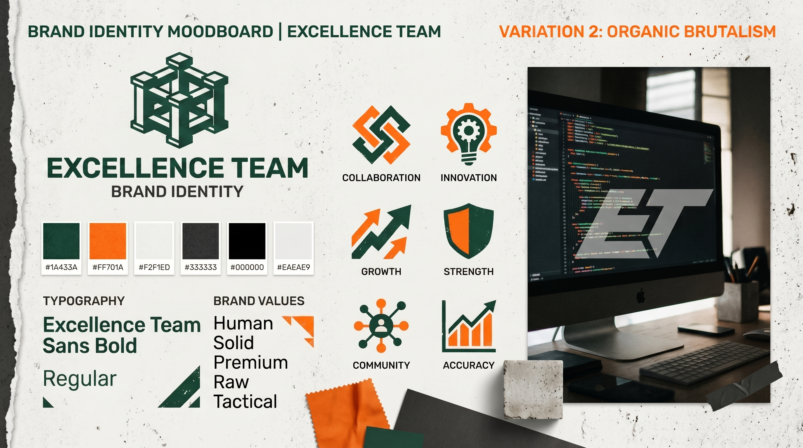
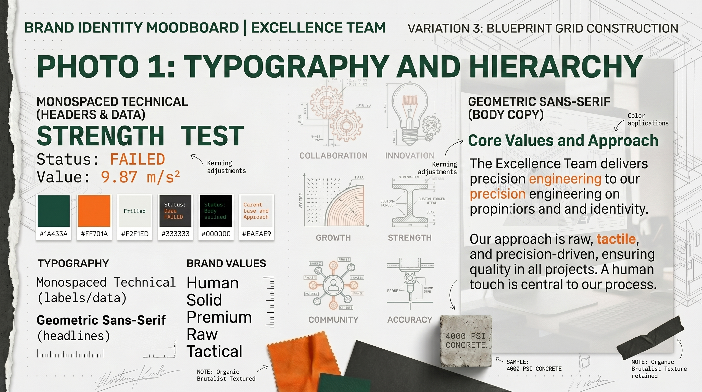
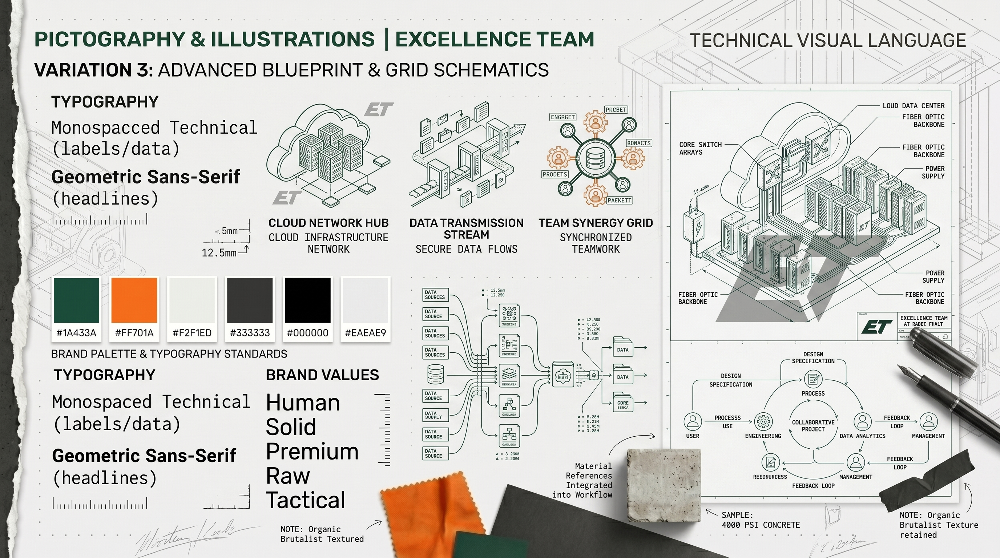
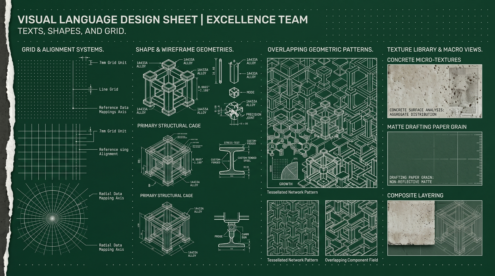

# Direction Artistique & Moodboard — Excellence Team
## Note d'Intention & Univers Visuel (MOODBOARD.md)

Ce document décrit l'univers d'inspiration d'**Excellence Team**. Il sert de guide aux designers et créatifs pour s'assurer que chaque support reflète la vigueur, l'audace et le professionnalisme de notre collectif de jeunes talents de la tech.

---

## 1. Le Concept Artistique : "Tech Naturelle & Vigueur Brutaliste"

L'identité d'Excellence Team est née de la confrontation de deux mondes :
1.  **La Nature & la Rigueur Tempérée (Deep Forest Green) :** Représentée par un vert forêt très sombre, quasi-noir. Il symbolise le sérieux, la pérennité, la concentration universitaire et la profondeur algorithmique.
2.  **L'Énergie & l'Innovation Tech (Tech Orange) :** Un orange électrique qui fuse. Il évoque l'action immédiate, le hackathon nocturne, le dynamisme et le refus du statu quo.

Cette dualité se traduit graphiquement par des structures très géométriques, un espacement aéré, et des touches de lumière orange vive pour diriger le regard.

---

## 2. Le Moodboard de Référence

Le moodboard officiel capture la synergie de groupe, l'environnement de travail collaboratif et l'esthétique minimaliste-brutaliste qui définit notre marque.

### Aperçu Visuel du Moodboard de l'Équipe

*   **Vibe générale :** Collaboration active, concentration intense sous des éclairages doux et contrastés, écrans affichant du code et des architectures logicielles, espaces ouverts et minimalistes.
*   **Palette de ressenti :** Professionnel, déterminé, axé sur la tech et l'innovation ouverte (Open Source).

---

## 3. Feuilles d'Inspiration Linguistique et Visuelle

Pour guider l'intégration visuelle sur tous les supports, trois feuilles de spécification de langage graphique ont été définies :

### A. Guide de Langage Visuel Global
Ce document définit les textures de base, les jeux d'ombres et la disposition générale des blocs graphiques.

### B. Traitement des Images et Pictogrammes
Ce guide technique encadre le choix des illustrations, l'usage des icônes filaires (stroke style) et le fenêtrage des captures d'écran.

### C. Spécifications Textuelles et Typographiques
Il détaille l'équilibre typographique en situation réelle (titrage, emphase Consolas, bloc de code stylisé).

---

## 4. Recommandations pour l'Intégration d'Images

*   **Contrastes élevés :** Les photos d'équipe doivent éviter les ambiances ternes ou "stock-shot" impersonnelles. Préférer des clichés pris sur le vif pendant des séances de conception ou des hackathons.
*   **Harmonie colorimétrique :** Ajuster la balance des blancs ou appliquer de légers filtres pour que les clichés s'intègrent harmonieusement avec notre `#1A433A` (Vert forêt) ou notre fond slate.
*   **Mockups Applicatifs :** Les mockups de produits technologiques doivent être présentés dans des cadres de fenêtres épurés, sans fioritures (Brutaliste minimal), mettant en valeur l'interface elle-même.
