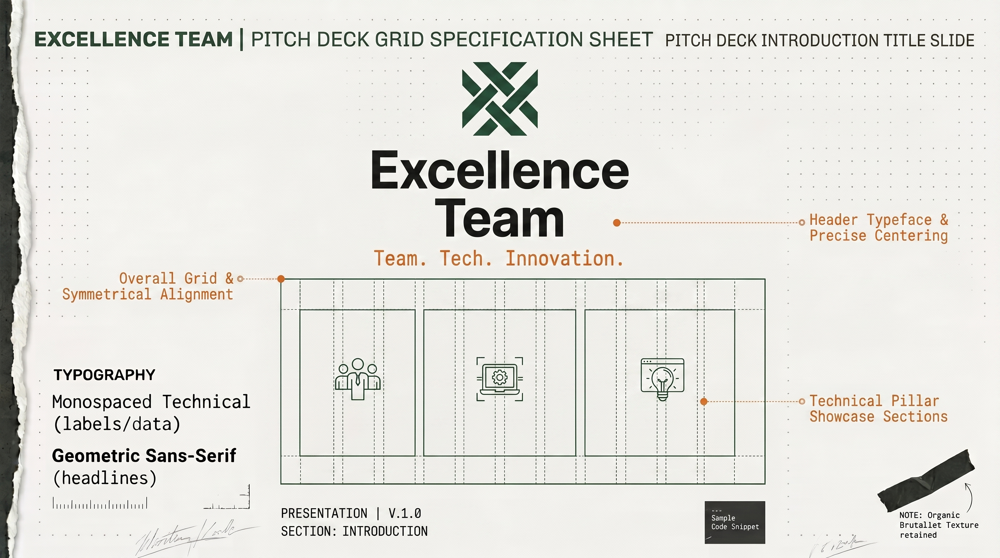
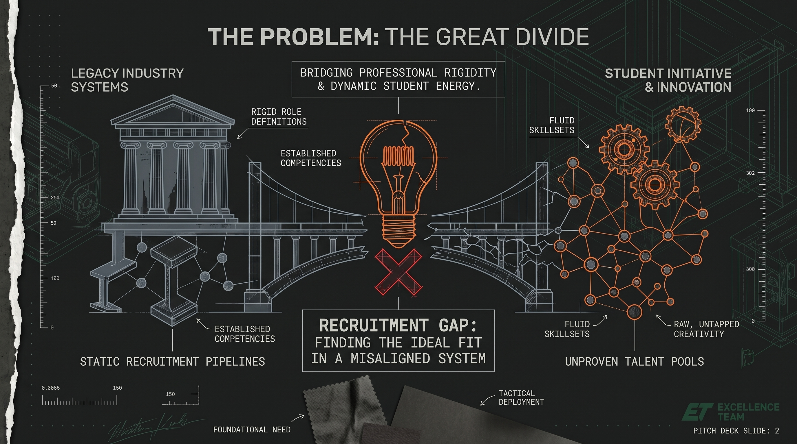
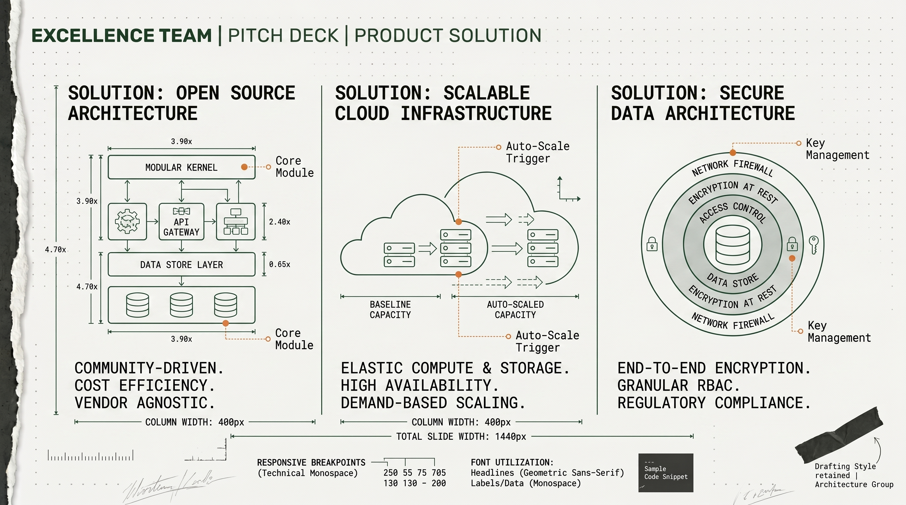
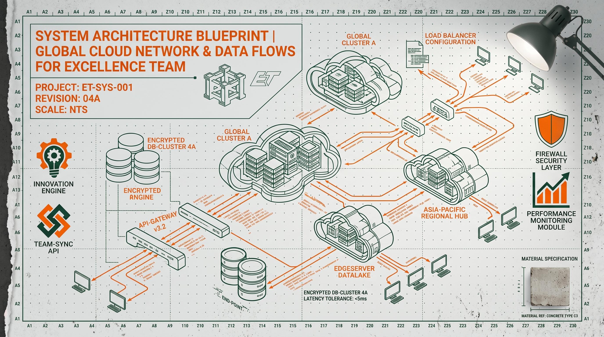
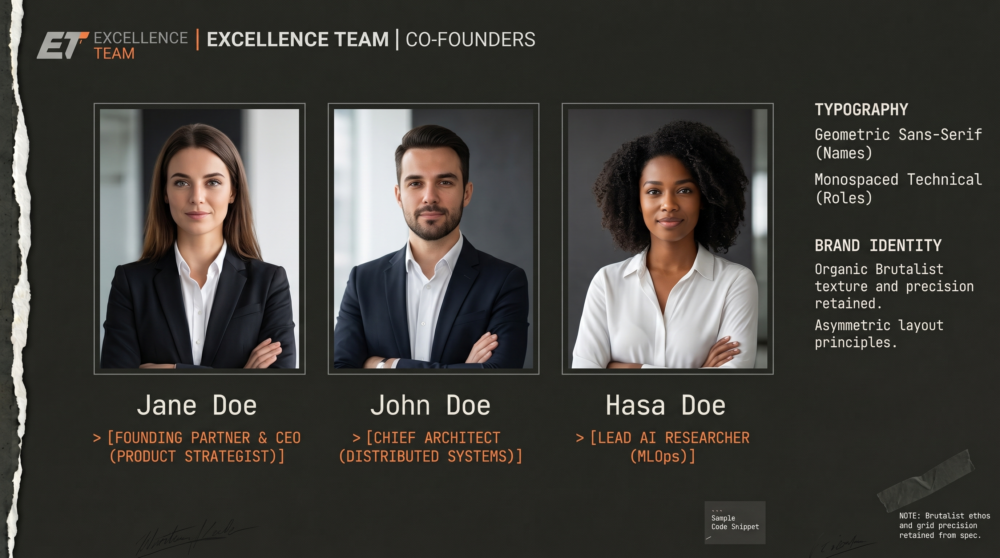
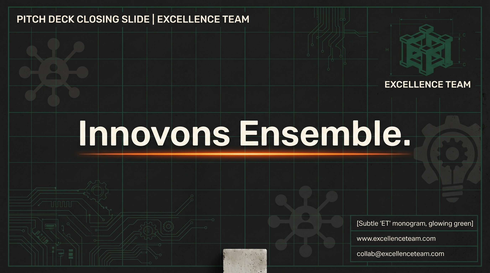

# Contenu de Présentation — Excellence Team
## Pitch Deck Stratégique (PRESENTATION.md)

Ce document fournit le contenu textuel complet du Pitch Deck d'**Excellence Team**, rédigé selon les principes stricts du guide de rédaction de conversion (Copywriting). Chaque diapositive intègre des annotations stratégiques, des alternatives et des métadonnées SEO pour un partage en ligne.

---

## MÉTADONNÉES DE LA PRÉSENTATION (SEO)
*   **Titre SEO :** Excellence Team | Révolutionner l'Innovation Tech par les Étudiants
*   **Description SEO :** Découvrez comment Excellence Team prouve que l'innovation de pointe et le développement SaaS de niveau mondial naissent de la vigueur et de la synergie étudiante.

---

## DIAPOSITIVE 1 : LA COUVERTURE (HERO SLIDE)

### Visuel Associé

### Contenu Textuel
*   **Sur-titre (Monospace) :** EXCELLENCE TEAM
*   **Titre Principal (Headline) :** L'innovation tech n'attend pas les années d'expérience.
*   **Sous-titre (Subheadline) :** Nous construisons des architectures cloud robustes et des applications SaaS scalables, propulsées par l'énergie des meilleurs talents universitaires.
*   **Bouton d'Action (Primary CTA) :** Explorer nos projets open-source
*   **Métadonnées de Diapositive (Monospace) :** Présenté par : Collectif Excellence Team | Date : 2026 | Version : 1.0 | CONFIDENTIEL

### Annotations de Copywriting
*   *Principe appliqué :* **Clarté et Réfutation du Préjugé**. Le titre principal s'attaque directement à l'objection majeure : le manque d'expérience. Il affirme une vérité forte ("n'attend pas les années d'expérience") de manière confiante, éliminant les adverbes superflus.
*   *Bouton d'Action :* Orienté action. "Explorer nos projets open-source" dit précisément à l'utilisateur ce qu'il va obtenir, plutôt qu'un vague "En savoir plus".

### Alternatives Rédactonnelles
*   *Alternative Titre A (Focus Vigueur) :* La vigueur étudiante au service des architectures de demain.
    *   *Rationale :* Met en avant l'énergie et la modernité des profils académiques.
*   *Alternative Titre B (Focus Solution) :* L'ingénierie logicielle d'excellence, conçue par la jeune génération.
    *   *Rationale :* Valorise le niveau de compétence technique pure.
*   *Alternative CTA :* Voir nos cas d'usage réels

---

## DIAPOSITIVE 2 : LE CONSTAT (LE PROBLÈME)

### Visuel Associé

*(Alternative visuelle disponible : `../Pitch_deck_problem_slide_design_202608070023.jpeg`)*

### Contenu Textuel
*   **Tag de Diapositive (Monospace) :** 01 // LE DÉFI
*   **Titre Principal (Headline) :** Pourquoi la tech d'entreprise stagne-t-elle ?
*   **Corps du Texte :**
    Les solutions logicielles existantes souffrent de trois freins majeurs :
    *   **Lenteur de déploiement :** Les structures traditionnelles mettent des mois à adapter leurs outils.
    *   **Manque de souveraineté :** Les données locales sont externalisées sans garantie de confidentialité.
    *   **Déconnexion terrain :** Des outils complexes conçus loin des utilisateurs réels.

### Annotations de Copywriting
*   *Principe appliqué :* **Question Rhétorique**. "Pourquoi la tech d'entreprise stagne-t-elle ?" pousse l'interlocuteur à s'interroger sur sa propre situation.
*   *Simplicité :* Évitement des termes de jargon comme "optimiser le workflow" au profit de descriptions claires ("lenteur de déploiement", "données externalisées").

### Alternatives Rédactonnelles
*   *Alternative Titre A :* Le retard technologique coûte des millions aux PME locales.
    *   *Rationale :* Focus sur la douleur financière du client.
*   *Alternative Titre B :* Des systèmes complexes que vos équipes rejettent.
    *   *Rationale :* Focus sur le problème d'adoption utilisateur.

---

## DIAPOSITIVE 3 : LA SOLUTION (LE PRODUIT)

### Visuel Associé

### Contenu Textuel
*   **Tag de Diapositive (Monospace) :** 02 // LA SOLUTION
*   **Titre Principal (Headline) :** Des logiciels performants livrés en deux semaines.
*   **Corps du Texte :**
    Nous créons des applications web et SaaS taillées pour le terrain :
    *   **Vitesse d'exécution :** Un cycle de développement agile axé sur un prototype fonctionnel immédiat.
    *   **Sécurité intégrée :** Chiffrement local et hébergement cloud souverain pour protéger vos secrets d'affaires.
    *   **Interface intuitive :** Un design centré sur l'utilisateur, éliminant les clics inutiles.
*   **Bouton d'Action (Primary CTA) :** Lancer une simulation de projet

### Annotations de Copywriting
*   *Principe appliqué :* **Spécificité et Bénéfice**. Au lieu de dire "Développement rapide", nous écrivons "livrés en deux semaines". C'est mesurable, crédible et engageant.
*   *Pas d'exclamation :* Le ton reste calme, assertif et professionnel.

### Alternatives Rédactonnelles
*   *Alternative Titre A :* Reprenez le contrôle de vos données logicielles.
    *   *Rationale :* Accent sur le bénéfice de sécurité et de propriété.
*   *Alternative CTA :* Demander une démonstration gratuite

---

## DIAPOSITIVE 4 : L'ARCHITECTURE TECHNIQUE (TECH FOCUS)

### Visuel Associé

### Contenu Textuel
*   **Tag de Diapositive (Monospace) :** 03 // ARCHITECTURE & BLUEPRINT
*   **Titre Principal (Headline) :** Une infrastructure moderne, robuste et ouverte.
*   **Corps du Texte :**
    Notre stack technique repose sur trois piliers d'ingénierie :
    *   **Composants Open-Source :** Indépendance totale vis-à-vis des licences éditeurs.
    *   **Pipeline Cloud Souverain :** Déploiement automatisé sur serveurs locaux sécurisés.
    *   **Architecture API-First :** Intégration facile avec vos outils de comptabilité ou ERP existants.

### Annotations de Copywriting
*   *Principe appliqué :* **Bénéfices dérivés**. L'infrastructure n'est pas juste décrite par ses technologies, mais par ce qu'elle apporte au client : "indépendance totale", "intégration facile".

---

## DIAPOSITIVE 5 : L'ÉQUIPE (TEAM FOCUS)

### Visuel Associé

*(Alternatives visuelles disponibles : `../Minimalist_pitch_deck_team_slide_202608070032.jpeg` ou `../Excellence_Team_pitch_deck_slide_202608070032.jpeg`)*

### Contenu Textuel
*   **Tag de Diapositive (Monospace) :** 04 // COLLECTIF & VIGUEUR
*   **Titre Principal (Headline) :** La force de l'apprentissage par la pratique.
*   **Corps du Texte :**
    Excellence Team réunit les meilleurs étudiants en ingénierie et design. Sans le poids des méthodes obsolètes, nous apportons :
    *   **Vigueur et réactivité :** Une disponibilité totale et une vitesse d'apprentissage hors pair.
    *   **Pragmatisme :** Nous apprenons en faisant, validant chaque brique de code par des tests rigoureux.
    *   **Solidarité :** Un collectif soudé qui partage ses compétences pour résoudre vos défis complexes.

### Annotations de Copywriting
*   *Principe appliqué :* **Honnêteté et Valorisation**. Nous ne prétendons pas avoir 20 ans d'expérience. Nous présentons l'absence d'habitudes d'entreprise comme un atout majeur de fraîcheur et de réactivité.

---

## DIAPOSITIVE 6 : LE MOT DE LA FIN (CONCLUSION & CTA)

### Visuel Associé

*(Alternative visuelle disponible : `../Excellence_Team_pitch_deck_closi…_202608070035 (1).jpeg`)*

### Contenu Textuel
*   **Tag de Diapositive (Monospace) :** TEAM • TECH • INNOVATION
*   **Titre Principal (Headline) :** Bâtissons votre prochaine innovation.
*   **Sous-titre (Subheadline) :** Rejoignez un collectif d'étudiants talentueux déterminés à redéfinir les standards de la tech d'entreprise.
*   **Canaux de Contact (Monospace) :**
    *   *E-mail :* contact@excellenceteam.com
    *   *Site Web :* www.excellenceteam.com
    *   *GitHub :* @ExcellenceTeam
*   **Bouton d'Action (Primary CTA) :** Planifier un entretien technique

### Annotations de Copywriting
*   *Principe appliqué :* **Réciprocité et Collaboration**. "Bâtissons..." implique une relation de partenariat d'égal à égal.
*   *Bouton d'Action :* "Planifier un entretien technique" cible des clients à la recherche d'une expertise technique réelle plutôt que de promesses commerciales.
